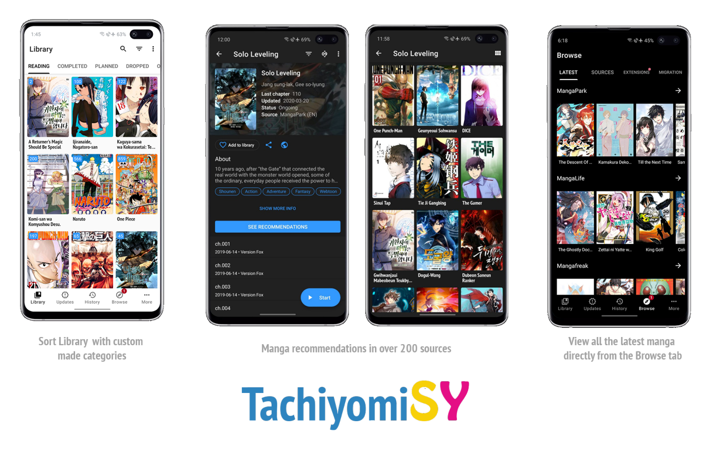

 

<h1 align="center"> Komikku </h1>

| Releases | Preview | CI builds | Discussions |
|----------|---------|-----------|-------------|
|    |    |  |  |

A free and open source manga reader which is based off TachiyomiSY & Mihon/Tachiyomi. This fork is meant to provide new & useful features while regularly take features/updates from Mihon or other forks like SY, J2K and Neko...

## Features

### Komikku's key features:
- [x] Built-in extensions repository, always up-to-date with Keiyoushi with a few more sources & improvements.
- [x] `Suggestions` automatically showing source-website's recommendations/suggestions/related to current entry for all sources.
- [x] Auto theme color based on each entry's cover for entry View & Reader.
- [x] 2-way sync progress with trackers, automatically.
- [x] `Feed` now supports all sources, with more items (20 for now).
- [x] `Bulk-selection` to add to library & change categories of multiple entries all at once, everywhere.
- [x] Long-click to add/remove single entry to/from library, everywhere.
- [x] Search for sources & Quick NSFW sources filter in Extensions, Browse & Migration screen.
- [x] `Feed` backup/restore/sync/re-order.
- [x] Banner shows Library syncing / Backup restoring / Library updating progress.
- [x] Configurable interval to refresh entries from downloaded storage.
- [x] App custom theme, more app themes & better UI, improvements...

  
Features from Mihon/Tachiyomi

#### All up-to-date features from Mihon/Tachiyomi (original), include:

* Online reading from a variety of sources
* Local reading of downloaded content
* A configurable reader with multiple viewers, reading directions and other settings.
* Tracker support: [MyAnimeList](https://myanimelist.net/), [AniList](https://anilist.co/), [Kitsu](https://kitsu.app/), [MangaUpdates](https://mangaupdates.com), [Shikimori](https://shikimori.one), and [Bangumi](https://bgm.tv/) support
* Categories to organize your library
* Light and dark themes
* Schedule updating your library for new chapters
* Create backups locally to read offline or to your desired cloud service
* Continue reading button in library

  
Features from Tachiyomi SY

#### All features from TachiyomiSY:
* Feed tab, where you can easily view the latest entries or saved search from multiple sources at same time.
* Automatic webtoon detection, allowing the reader to switch to webtoon mode automatically when viewing one
* Manga recommendations, uses MAL and Anilist, as well as Neko Similar Manga for Mangadex manga (Thanks to Az, She11Shocked, Carlos, and Goldbattle)
* Lewd filter, hide the lewd manga in your library when you want to
* Tracking filter, filter your tracked manga so you can see them or see non-tracked manga, made by She11Shocked
* Search tracking status in library, made by She11Shocked
* Custom categories for sources, liked the pinned sources, but you can make your own versions and put any sources in them
* Manga info edit
* Manga Cover view + share and save
* Dynamic Categories, view the library in multiple ways
* Smart background for reading modes like LTR or Vertical, changes the background based on the page color
* Force disable webtoon zoom
* Hentai features enable/disable, in advanced settings
* Quick clean titles
* Source migration, migrate all your manga from one source to another
* Saving searches
* Autoscroll
* Page preload customization
* Customize image cache size
* Batch import of custom sources and featured extensions
* Advanced source settings page, searching, enable/disable all
* Click tag for local search, long click tag for global search
* Merge multiple of the same manga from different sources
* Drag and drop library sorting
* Library search engine, includes exclude, quotes as absolute, and a bunch of other ways to search
* New E-Hentai/ExHentai features, such as language settings and watched list settings
* Enhanced views for internal and integrated sources
* Enhanced usability for internal and delegated sources

Custom sources:
* E-Hentai/ExHentai

Additional features for some extensions, features include custom description, opening in app, batch add to library, and a bunch of other things based on the source:
* 8Muses (EroMuse)
* HBrowse
* Mangadex
* NHentai
* Puruin
* Tsumino

## Download
Get the app from our [releases page](https://github.com/komikku-app/komikku/releases/latest).

If you want to try new features before they get to the stable release, you can download the preview version [here](https://github.com/komikku-app/komikku-preview/releases/latest).

## Issues, Feature Requests and Contributing

Please make sure to read the full guidelines. Your issue may be closed without warning if you do not.

Issues

1. **Before reporting a new issue, take a look at the [FAQ](https://tachiyomi.org/docs/faq/general), the [changelog](https://github.com/komikku-app/komikku/releases) and the already opened [issues](https://github.com/komikku-app/komikku/issues).**
2. If you are unsure, ask here: 

Bugs

* Include version (More → About → Version)
 * If not latest, try updating, it may have already been solved
 * Preview version is equal to the number of commits as seen on the main page
* Include steps to reproduce (if not obvious from description)
* Include screenshot (if needed)
* If it could be device-dependent, try reproducing on another device (if possible)
* Don't group unrelated requests into one issue

Use the [issue forms](https://github.com/komikku-app/komikku/issues/new/choose) to submit a bug.

Feature Requests

* Write a detailed issue, explaining what it should do or how.
* Include screenshot (if needed).

Contributing

See [CONTRIBUTING.md](./CONTRIBUTING.md).

Code of Conduct

See [CODE_OF_CONDUCT.md](./CODE_OF_CONDUCT.md).

## FAQ

[See our website.](https://komikku-app.github.io/)
You can also reach out to us on [Discord](https://discord.gg/85jB7V5AJR).

## License

    Copyright 2015 Javier Tomás

    Licensed under the Apache License, Version 2.0 (the "License");
    you may not use this file except in compliance with the License.
    You may obtain a copy of the License at

    http://www.apache.org/licenses/LICENSE-2.0

    Unless required by applicable law or agreed to in writing, software
    distributed under the License is distributed on an "AS IS" BASIS,
    WITHOUT WARRANTIES OR CONDITIONS OF ANY KIND, either express or implied.
    See the License for the specific language governing permissions and
    limitations under the License.

## Disclaimer

The developer of this application does not have any affiliation with the content providers available.
